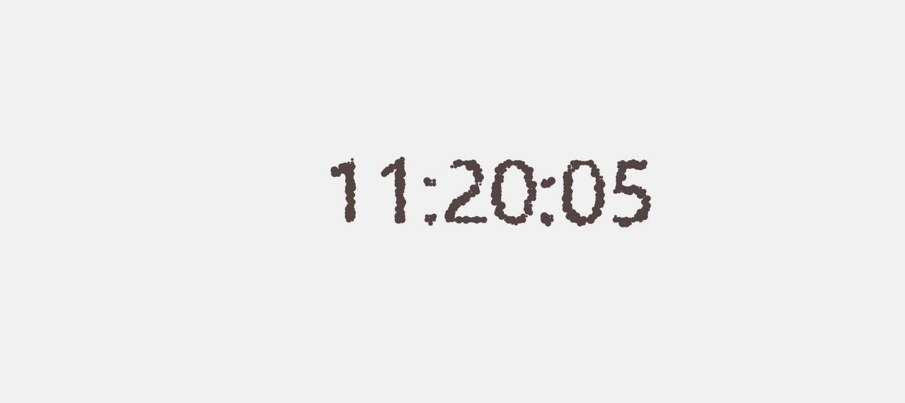

# 粒子时钟



这个时钟其实是一个个的小粒子组成的，首先我们进行可以先进行单个粒子的绘制，


### 创建容器

```js
//初始化canvas 
const canvas = document.querySelector("canvas");
 const ctx = canvas.getContext("2d", { willReadFrequently: true });
 function initSize() {
        canvas.width = innerWidth * devicePixelRatio;
        canvas.height = innerHeight * devicePixelRatio;
    }
  initSize();
```

这里初始化canvas容易 让宽度和高度 * 缩放比例 `devicePixelRatio`


### 图形的绘制


首先这个粒子初始化的状态是围绕成一个圆的，再圆的边缘上进行随机的分布的，我们这个时候就需要拿到他随机所在的位置，然后再这个位置上进行绘制

```js
   class Particle {
        constructor() {
          this.size = getRandom(2 * devicePixelRatio, 7 * devicePixelRatio);
          const r = Math.min(canvas.width, canvas.height) / 2;
          const rad = (getRandom(0, 360) * Math.PI) / 180;
          const cx = canvas.width / 2;
          const cy = canvas.height / 2;
          this.x = cx + r * Math.cos(rad);
          this.y = cy + r * Math.sin(rad);
        }
	}
```

`size` 是我们这个粒子的大小 传入一个随机的大小，也是*当前的缩放比例 `devicePixelRatio` 

`r` 收我们围绕的这个圆的半径 我们通过取`canvas`宽高的最小值获取

`rad` 是获取一个随机的弧度 用来计算所在的位置（180度 = 3.14弧度）所以我们这里去随机的0-360度的弧度

`cx` `cy`是获取到中心点

`x``y` 是计算粒子要所在的位置 ，`Math.cos ``Math.sin` 是通过弧度拿到所在的距离圆心的位置 取值是（1，-1）中心点是0，我们就用半径 * 弧度所计算出来的位置加上中心点就拿到了一个圆边的位置


参数都有了 接下来就是画了

```js
  draw() {
          ctx.beginPath();
          ctx.arc(this.x, this.y, this.size, 0, Math.PI * 2); // 画圆
          ctx.fillStyle = "#544544"; // 设置填充颜色
          ctx.fill();
        }
```


 再有就是移动函数 因为我们初始化虽然是围绕这圆来随机分布的  但是后面还是要移动到对应的事件位置上的

```js
  moveTo(tx, ty) {
          const duration = 500;
          const sx = this.x;
          const sy = this.y;
          const xSpeed = (tx - sx) / duration;
          const ySpeed = (ty - sy) / duration;
          const startTime = Date.now();
          const _move = () => {
            const t = Date.now() - startTime;
            const x = sx + xSpeed * t;
            const y = sy + ySpeed * t;
            this.x = x;
            this.y = y;
            if (t >= duration) {
              this.x = tx;
              this.y = ty;
              return;
            }
            requestAnimationFrame(_move);
          };
          _move();
        }
```

`duration` 设置一个移动时间，接受要移动到的位置  `requestAnimationFrame` 递归调用

 ### 绘制

上面的移动绘制都弄好了 就需要通过绘制多个粒子而去放到对应的位置

```js
  // 例子容器
  const particles = [];
```

 创建一个容器用来存放粒子

我们是每一帧都需要进行绘制的，而且需要知道当前绘制需要有多少个粒子，所以创建一个函数，用来创建每个实例对应的位置，和当前需要的粒子数量来创建实例。后面调用实例的draw()来移动

要知道点位需要移动到的位置和所需数量，可以通过先绘制一个文字 然后通过遍历canvas的像素点信息，拿到需要所在的位置和像素点信息


```js
  // 获取要绘制的文字信息
      let text = null;    
function update() {
        // 获取文字信息
        const curText = getText();
        if (text === curText) {
          return;
        }
        clear();
        text = curText;
        const { width, height } = canvas;
        ctx.fillStyle = "#000";
        ctx.textBaseline = "middle";
        ctx.font = `${140 * devicePixelRatio}px 'Roboto Mono', sans-serif`; // 设置字体
        ctx.textAlign = "center";
        ctx.fillText(text, width / 2, height / 2);
        // 拿到像素信息
        const points = getPoints();
        clear();
        for (let i = 0; i < points.length; i++) {
          const [x, y] = points[i];
          let p = particles[i];
          if (!p) {
            p = new Particle();
            particles.push(p);
          }
          p.moveTo(x, y);
        }
        if (points.length < particles.length) {
          particles.splice(points.length);
        }
      }
```

getText() 获取当前时间 判断当前时间与绘制的字体是否一样  一样则不需要更新 不一样的画就清除当前画布，绘制文字信息  这里的清除是为了准确的拿到文字的像素点信息 然后通过getPoints()获取数量和位置。如果少了的话则创建一个 多了的话再删除掉 通过`moveTo` 改变位置信息 

```js
     function getPoints() {
        let points = [];
        const { data } = ctx.getImageData(0, 0, canvas.width, canvas.height);
        const gap = 6;
        for (let i = 0; i < canvas.width; i += gap) {
          for (let j = 0; j < canvas.height; j += gap) {
            const index = (i + j * canvas.width) * 4;
            const r = data[index];
            const g = data[index + 1];
            const b = data[index + 2];
            const a = data[index + 3];
            if (r === 0 && g === 0 && b === 0 && a === 255) {
              points.push([i, j]);
            }
          }
        }
        return points;
      }
```

getPoints主要是通过ctx.getImageData 可以拿到当前像素点的rgba 的一维数组 例如两个像素点的话数组就是这样的【r,g,b,a,r,g,b,a】然后我们用当前所在行（j） * 当前列（i）+当前所在行就拿到了当前像素点的位置，然后通过当前像素点的index*4拿到`r`所在的位置判断当前像素点的信息是否是黑色不透明的 然后返回其位置


```js
   function draw() {
        clear();
        update();
        for (const p of particles) {
          p.draw();
        }
        requestAnimationFrame(draw);
      }
draw()
```

后面就是循环调用了 每次调用都清除掉上次所绘制的 `update`也更新了像素信息  只需要调用实例的draw()方法从新绘制即可